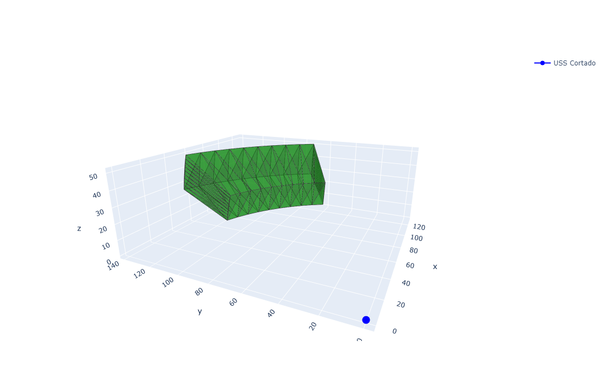

# Battleship

The game, but more involved

## Offense


## Defense

Use a radar to help defend

```python
from battleship import Radar

radar = Radar(range=[100, 150], theta=[30, 70], phi=[10, 20])

fig = radar.plot()
fig.show()
```

Or create a ship and setup a radar

```python
from battleship import Ship

ship = Ship(0, 0, name="USS Cortado")
ship.setup_radar(range=[100, 150], theta=[30, 70], phi=[10, 20])

fig = ship.plot()
fig.show()
```


